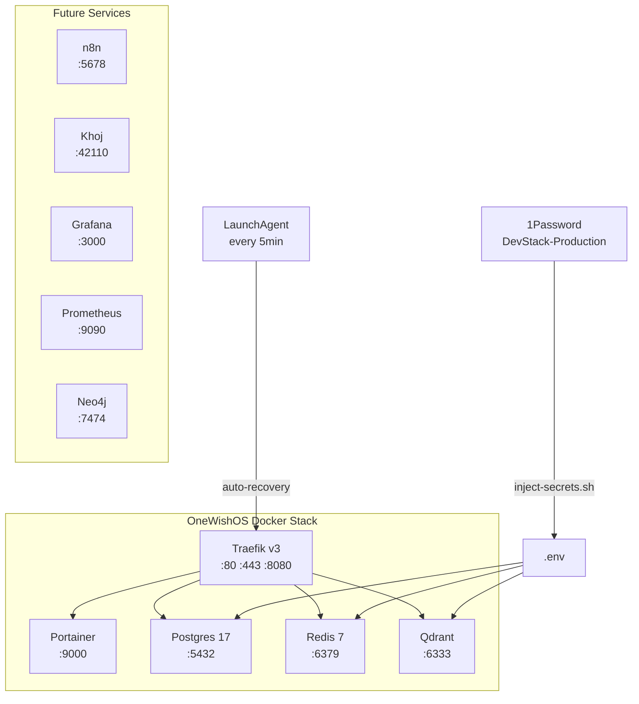

# OneWishOS Docker Stack


Production-ready Docker infrastructure for the **OneWishOS** ecosystem. Provides core services (database, cache, vector store, reverse proxy, container management) with automated secret injection from 1Password and self-healing via a macOS LaunchAgent.

## Prerequisites

- [Docker Desktop](https://www.docker.com/products/docker-desktop/) (v29+)
- [1Password CLI](https://developer.1password.com/docs/cli/) (`brew install --cask 1password-cli`)
- Make (`xcode-select --install`)
- GitHub CLI (`brew install gh`)

## Quick Start

```bash
# 1. Clone the repo
git clone https://github.com/connectedagents/docker-stack.git
cd docker-stack

# 2. Inject secrets from 1Password
make secrets

# 3. Start the stack
make up

# 4. Verify all services are healthy
make health
```

## Services

| Service | Container | Port | URL | Description |
|---------|-----------|------|-----|-------------|
| **Traefik** | onewish-traefik | 8080 | http://localhost:8080 | Reverse proxy & dashboard |
| **Portainer** | onewish-portainer | 9000 | http://localhost:9000 | Container management UI |
| **Postgres** | onewish-postgres | 5432 | — | Primary database (v17) |
| **Redis** | onewish-redis | 6379 | — | Cache & session store |
| **Qdrant** | onewish-qdrant | 6333 | http://localhost:6333 | Vector database |

## Traefik Subdomain Access

All services are also accessible via Traefik subdomains:

- `http://traefik.localhost` → Traefik dashboard
- `http://portainer.localhost` → Portainer UI

## Makefile Targets

```bash
make up          # Start the stack
make down        # Stop the stack
make restart     # Restart all services
make health      # Run health checks
make secrets     # Inject secrets from 1Password
make logs        # Tail all logs (or: make logs SERVICE=postgres)
make clean       # Prune Docker system
make up-all      # Inject secrets + start
make pull        # Pull latest images
make ps          # List running containers
make shell-pg    # Open Postgres shell
make shell-redis # Open Redis shell
make help        # Show all targets
```

## Architecture



## Project Structure

```
docker-stack/
├── compose/
│   ├── core.yml            # Traefik, Portainer, Postgres, Redis, Qdrant
│   ├── agents.yml          # n8n, Khoj (future)
│   ├── monitoring.yml      # Grafana, Prometheus, Dozzle (future)
│   ├── swarm.yml           # SwarmRICO Postgres, Neo4j (future)
│   └── mcp.yml             # MCP servers (future)
├── scripts/
│   ├── start.sh            # Full startup script
│   ├── health-check.sh     # Service health verification
│   ├── inject-secrets.sh   # 1Password → .env
│   └── docker-ops-agent.sh # Auto-recovery daemon
├── traefik/
│   ├── traefik.yml         # Static config
│   └── dynamic/
│       └── dynamic.yml     # Dynamic middleware
├── docker-compose.yml      # Root compose (includes core.yml)
├── .env.template           # Environment variable template
├── Makefile                # Task runner
├── README.md
└── RUNBOOK.md              # Operational runbook
```

## Future Services

The stack is designed to grow. Add services by uncommenting or expanding the stub compose files:

- **n8n** — Workflow automation (`compose/agents.yml`)
- **Khoj** — AI assistant (`compose/agents.yml`)
- **Grafana + Prometheus** — Monitoring (`compose/monitoring.yml`)
- **Dozzle** — Log viewer (`compose/monitoring.yml`)
- **Neo4j** — Graph database for litigation (`compose/swarm.yml`)

## Secret Management

Secrets are managed through 1Password vault `DevStack-Production`. Run `make secrets` to inject them into `.env`. Never commit `.env` to git.

Required 1Password items:
- `Postgres-Local` (username, password, database)
- `Qdrant-Local` (api_key)
- `Traefik-Local` (username, password)

## Contributing

1. Create a feature branch: `git checkout -b feat/my-feature`
2. Make changes and test: `make health`
3. Push and create PR: `gh pr create`

## License

MIT © Connected Agents / OneWish OS
